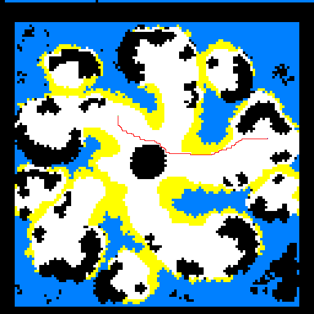

## Projet Pathfinding L3 Math-Info Nourry Nathan
Structure:
    
    src/
    
         readME.md
         dat/
            - 3 instances de .map
         src/
             main.jl
             pathFinding.jl
             SIPP.jl
         doc/
             doc.md

Il faut lancer depuis la racine du projet, dans le fichier main.jl il y a le test des 4 algorithmes
avec un point sur 3 cartes différents, Celle de Berlin, une carte de starcraft et une de Dragon Age (I ou II). La Troisième instance est celle de l'instance tiré au hasard, sur le points qui figuraient sur le diaporama. 

Le fichier main.jl contient les fonction utilitaires et les tests des algorithmes pour l'échelon 1.

Le fichier SIPP.jl lui contient tous les éléments de l'échelon 2.

Voici le code pour obtenir la carte en visuel comme ci-dessus:
`pathOnMap("theglaive.dat", algoAstar("theglaive.dat", (189, 193), (226, 437)), "output.png")`

Voici le code pour obtenir le résutlat d'un algorithme:

`path, cost, states = algoBFS("Berlin_0_256.map", (151, 2), (1, 2))`

`printResults("BFS", path, cost, states)`
